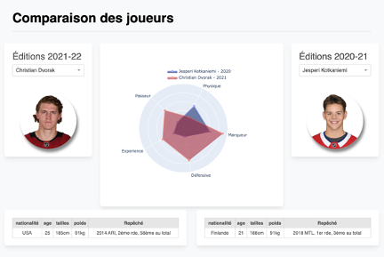

Montreal Canadiens Comparator 2020-21 Vs. 2021-22
==============================

Presents the difference between the skill sets of the 2020-21 vs. 2021-22 Montreal Canadiens' players.

You can use the live app with this [link](https://fluxion-ch.herokuapp.com/).



## Getting started

**Clone the repository**
``` bash
$ git clone https://github.com/Charles-de-Montigny/ds-coach-nhl
```

**Create virtual environnement**

``` bash
$ python3 -m virtualenv venv
```

**Activate environnement**

``` bash
$ source venv/bin/activate
```

**Install packages**

``` bash
$ pip install -r requirements.txt
```

**Start the application**

``` bash
$ python3 app.py
```

Project Organization
------------

    ├── LICENSE
    ├── README.md          <- The top-level README for developers using this project.
    │
    ├── assets             <- Include images, CSS and JavaScript files in that folder.
    │
    ├── data
    │   ├── external       <- Data from third party sources.
    │   ├── interim        <- Intermediate data that has been transformed.
    │   ├── processed      <- The final, canonical data sets for modeling.
    │   └── raw            <- The original, immutable data dump.
    │
    ├── requirements.txt   <- The requirements file for reproducing the analysis environment, e.g.
    │                         generated with `pip freeze > requirements.txt`
    │
    ├── setup.py           <- makes project pip installable (pip install -e .) so src can be imported
    │
    └── src                <- Source code for use in this project.
        ├── __init__.py    <- Makes src a Python module
        │
        ├── dataset.py     <- Script to download or generate data.
        │
        ├── utils.py       <- A collection of usage utility functions in python.
        │
        ├── layout.py      <- The layout of the app and it describes what the application looks like.
        │
        └── viz.py         <- Script to create plots, tables and maps oriented for data visualizations.
    

--------
